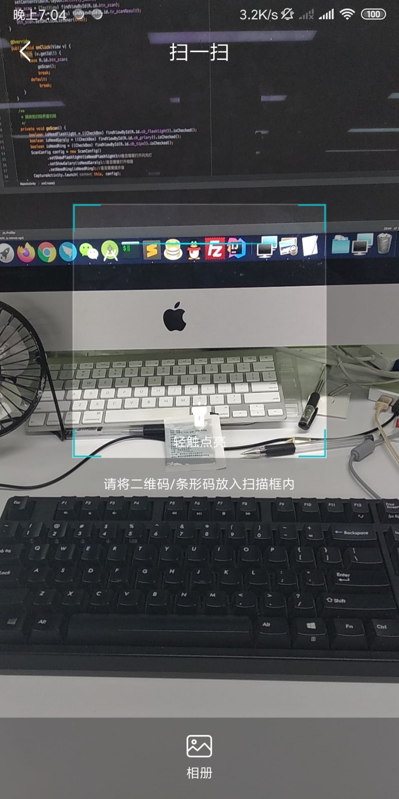

# **ScanCode**

## 扫描二维码条形码控件

### 系列

在工作之余，打算将一些常用的逻辑页面，模块，功能点做成library库，这样当有相似需求的时候，可以做到插拔式开发！现在系列中有以下内容

+ [App内部自动更新-AutoUpdateProject](https://github.com/MZCretin/AutoUpdateProject)
+ [选择城市-CitySelect](https://github.com/MZCretin/CitySelect)
+ [扫描二维码条形码控件-ScanCode](https://github.com/MZCretin/CitySeScanCode)

### 优势

+ **使用zBar进行二维码/条形码识别**
+ **可打开/关闭闪光灯**
+ **可打开相册扫描**
+ **使用简单，几行代码，即可拥有整个扫描识别功能**

### demo下载

[Demo下载](https://raw.githubusercontent.com/MZCretin/ScanCode/master/pic/demo.apk)

扫描二维码下载：

### 效果预览

### 使用方式

待续.... 今天下班了